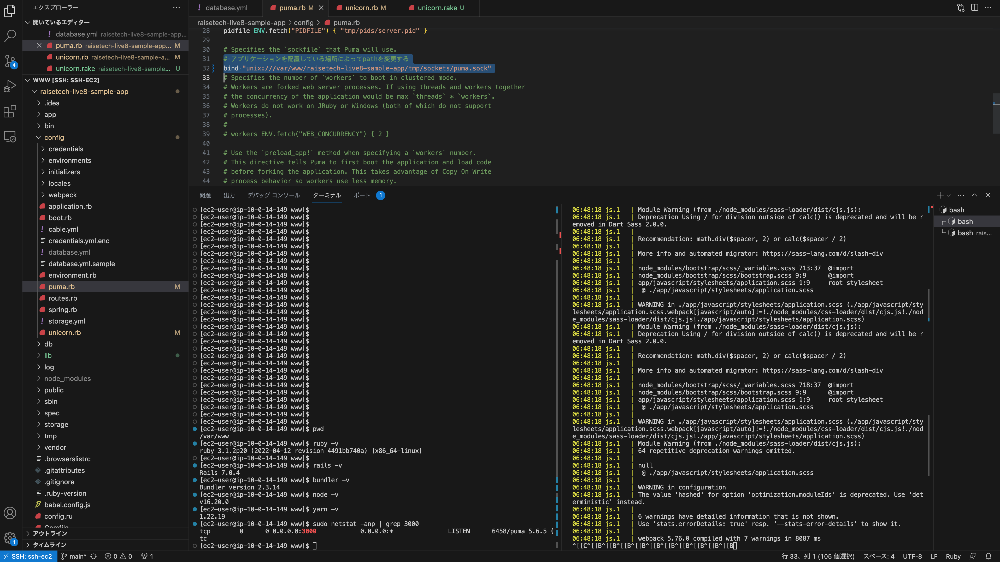
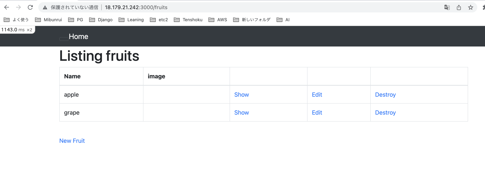
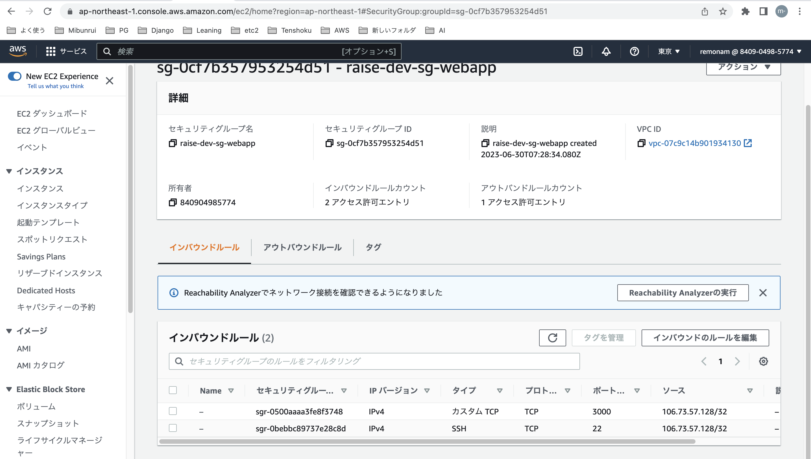
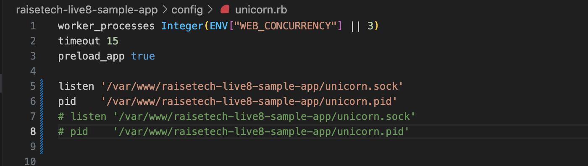
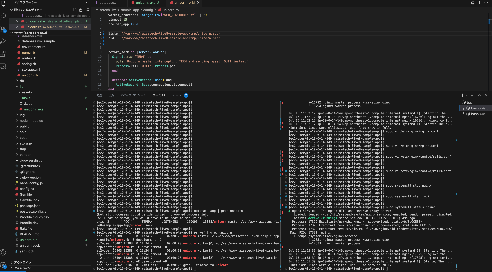
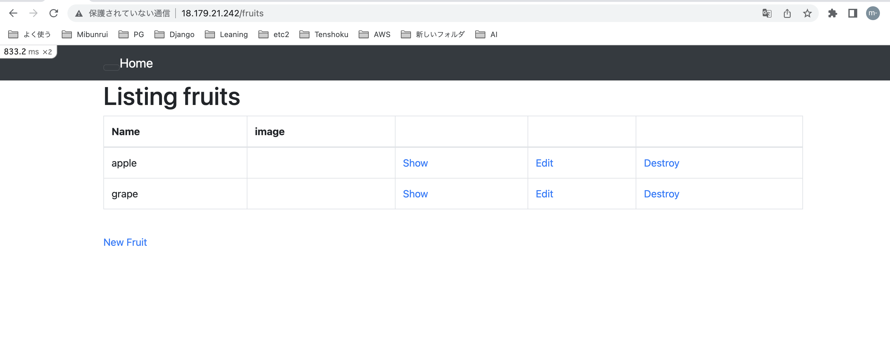
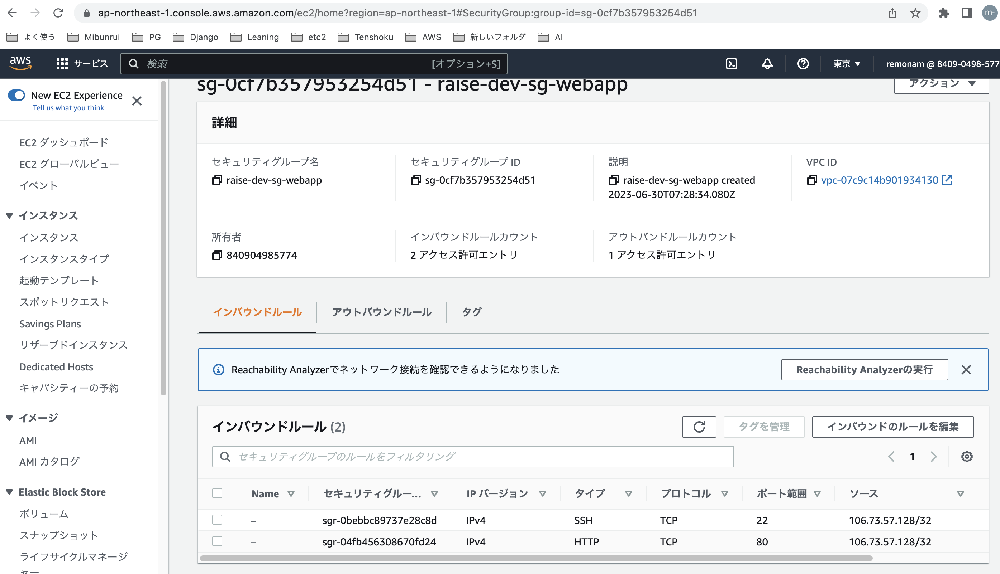
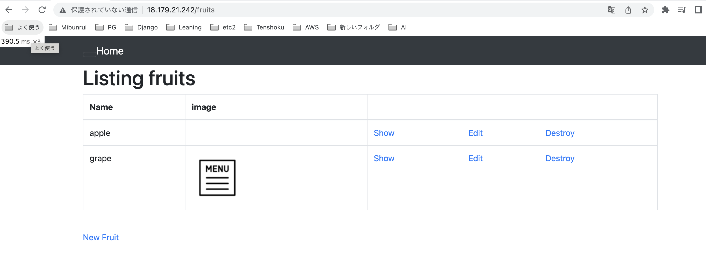
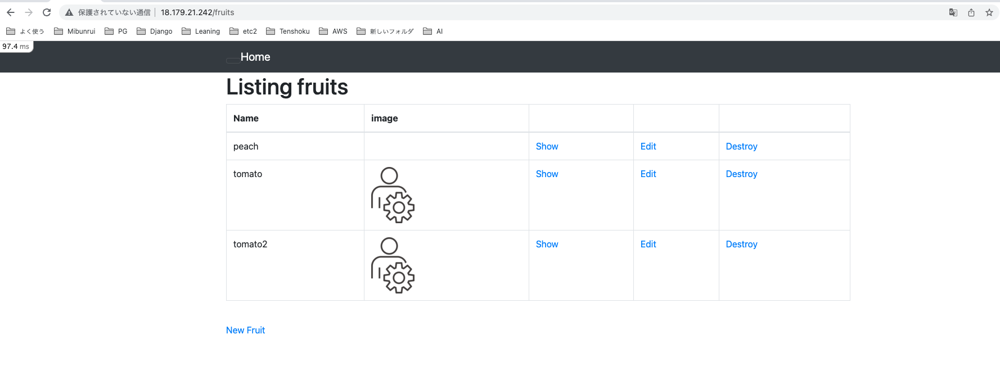
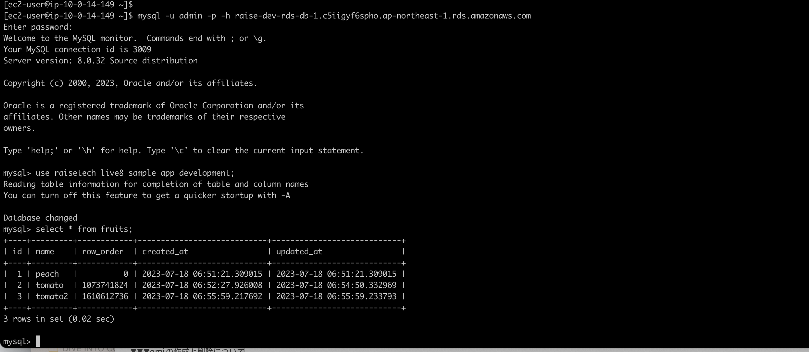

# 第5回課題提出-その１

## EC2のみでRailsサンプルアプリの動作環境を構築

▼ /bin/dev（つまりpuma）実行中  かつ　インストール済み各バージョン



▼ ブラウザで表示確認（http://グローバルIP:3000/fruits)



▼ セキュリティグループ設定（TCP3000をマイIPで許可)



## EC2のみ＋nginx+unicornでRailsサンプルアプリ表示

- unicorn.rbを編集

今回はec2にunicornインストール後のデフォルトの記述に対し
listen 〜　unicorn.sockの行と
pid    〜　unicorn.pidの行
だけ変更すればOKだった。

▼unicorn.rbの設定
　

```unicorn.rb {.copy}
listen '/var/www/raisetech-live8-sample-app/tmp/unicorn.sock'
pid    '/var/www/raisetech-live8-sample-app/tmp/unicorn.pid'
```

- unicorn.pidとunicorn.sockの格納パスは、各設定ファイルで app-name/tmp/unicorn.pidで統一した。
- unicorn起動・停止スクリプトを用意してサービス起動・停止を行なった。  
  
    - 起動コマンド rake unicorn:start  
    - 停止コマンド rake unicorn:stop  
    - 確認コマンド ps -ef | grep unicorn  

▼ nginx+unicorn実行中


▼ ブラウザで表示確認（http://グローバルIP:3000/fruits)



▼ セキュリティグループ設定（TCP80をマイIPで許可)



## DB添付画像が表示されない問題
- アプリのlog/development.logに　　
**「MiniMagick::Error (You must have ImageMagick or GraphicsMagick installed):」**  
と表示されているのを発見。
- *MiniMagick*についてググると、画面を縮小表示する有名なgemらしい。  

▼そもそも「ImageMagick」を各言語で使いやすくしたものの一つがMiniMagickというものらしい。　　
アプリのgemfileにはminimagik登場しないがlib/mini_magick配下ファイルには登場するので、　　
エラーにインストール必要と言われているので、ImageMagickをインストールしてみる。

'sudo yum install ImageMagick {.copy}'
 ↓ ブラウザをリロードしたら、画像が表示された！！



## DBはRDSを利用

1. database.ymlにhost: Rds_Dns_Name を追記
2. rails db:prepare
3. rails db:migrate
4. ブラウザで表示OK ＋ データ追記 ＋　画像添付  
　↓ EC2 + RDSの組み合わせでデータ保存できるようになった  
　▼ブラウザ表示結果

　▼RDSにmysqlログインしてselect文を実行した結果



