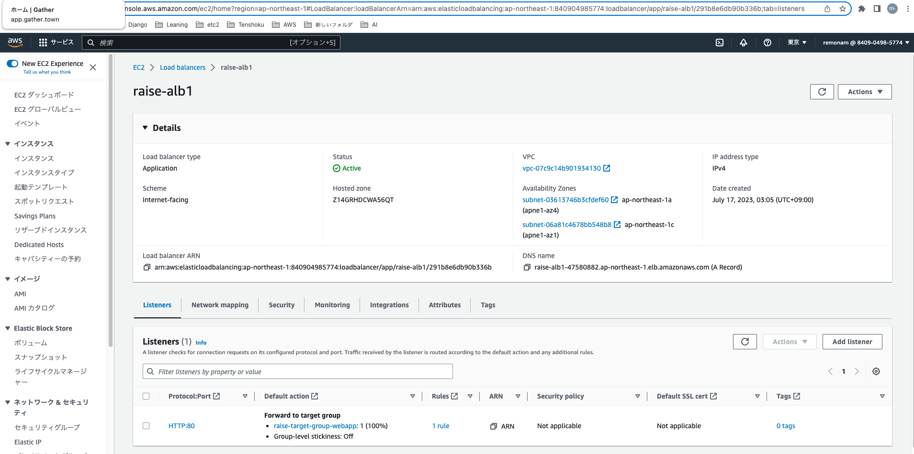
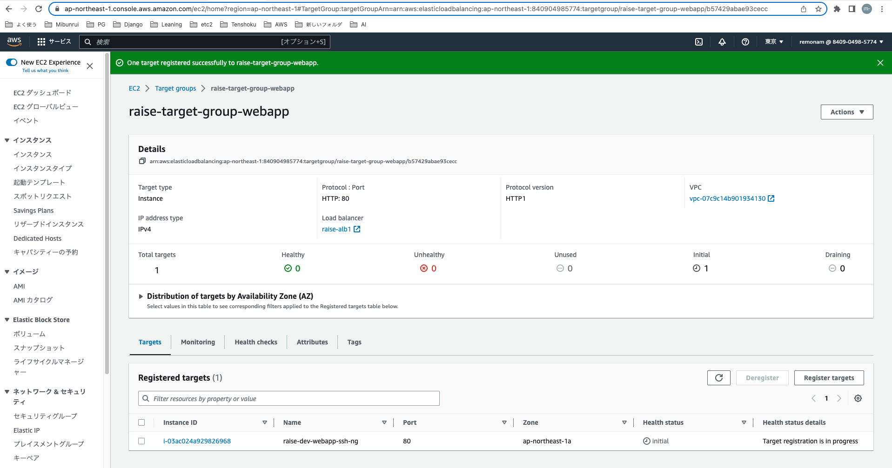

# 第5回課題提出-その2

ここまでで
EC2単体でのサンプルアプリ表示は完了している認識。
次はALB、S3を構成に加える。

## ALBを設定

- ALBの設定  

★サブネットに、パブリックIPの割り当て：有効というのは必要か？？

- ターゲットグループの作成
・
・

- ターゲットグループのターゲットにEC2を追加
・参考サイト　https://tokku-engineer.tech/awsalb-register-target-manual/
・Ports for the selected instances　は　「80」を選択。

 ※もしUnhealthyになってしまった場合は、ALBからEC2へ指定したポートでうまく疎通できていないということですので、ネットワークの設定及びEC2のnginxなどのwebサーバーの設定を見直しましょう。

## ALB経由でHTTP通信できているかの確認

- CloudWatch logsで確認できるようにする？

## RailsにALBを認識させる

- development.rbにconfig.host行を追記

> config.hosts << "raise-alb1-47580882.ap-northeast-1.elb.amazonaws.com"  

## AutoScaling
▼　まだ不要？

AutoScaling設定にて、
（例えば動的スケーリングで閾値をCPU８０％とかにして）
最大２、最小１に設定すれば、逼迫時はEC2x２台で運用できる。
最大２、最小2に設定すれば、常にEC2x２台で運用できる。
　
なおAutoScalingによるEC2インスタンス数の増減はCloudWatch Alarmsを使って管理しているらしい。

AutoScaling自体は無料だが、
EC2増えれば当然料金も増える。

## S3設定
- バケット名は一意じゃないといけない。Udemy講座を真似て、アカウントIDを含む文字列にした。（アカウントIDなんて見せびらかさないほうが良い気もするが。。）
- バケットはひとまずパブリックアクセス拒否で作成。あとで必要になったらパブリックアクセス許可する。
▼　S3の設定の画像を貼る

（（EC2がS3に画像をアップロードできるというロールを作成し、
それをEC2の許可ポリシーに追加する。））

▼確認コマンド
aws configure list

アップロードされた画像をS3に保存
railsアプリがアクティブストレージを使えるように準備するコマンドらしい。

bin/rails active_storage:install

bin/rails db:migrate
2つとも実行した。
db/migrateディレクトリに active_storage_blobs と active_storage_attachments が生成されるらしいが、違う名前のファイルがあった。
どこかで設定されている（？）
生成される前にdb/migrateディレクトリを確認しておくべきだった。
rails5くらいではバリテーションがなかったようだけど、rails7ではあるよう。

Gemfileの編集
Gemfileに以下の一行を加える。

gem 'mini_magick', '~> 4.8'

bundle install
storage.ymlの編集
storage.ymlを編集する
region: と bucket: にリージョンとバケット名を書く。
ダブルクォーテーションで囲む必要はない。

development.rbの編集
config/environments/development.rbを編集する

config.active_storage.service = :local :local の部分を :amazonに変更する。

EC2にロールを追加
EC2のロールにS3のポリシーがない時のエラー
error
EC2にS3アクセス権を追加する必要がある
とりあえずフルアクセスの追加をした。

１つ追加すると３つのオブジェクトがアップロードされた。

## 今回の課題で学んだこと
- railsを触ったことがなかったがrails用語や基本コマンド（マイグレーション、アプリ起動方法）などを知ることができた
