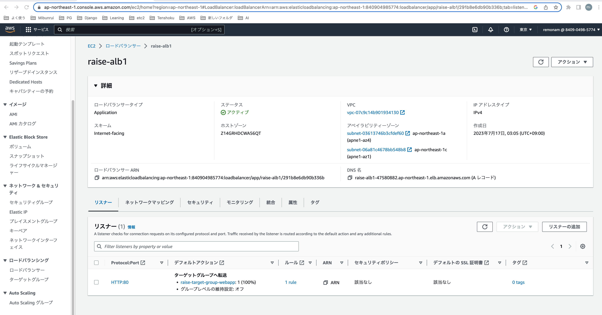
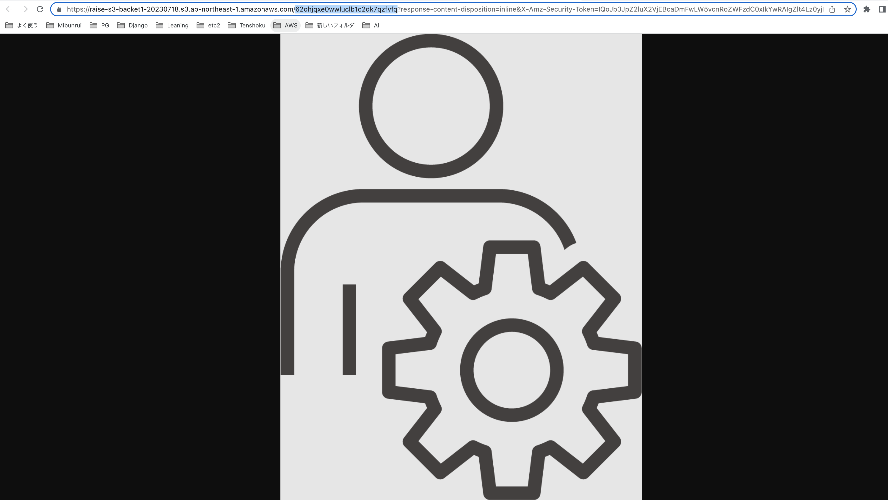

# 第5回課題提出-その2

- ここまでで、EC2単体でのサンプルアプリ表示は完了している。  
ここからさらに、ALB、S3を構成に加える。

## ALB用の設定
　※今回はまだインスタンス１台でまず構成。
　※よってAutoScalingもまだ設定しない。

- development.rbにconfig.host行を追記	
> config.hosts << "raise-alb1-47580882.ap-northeast-1.elb.amazonaws.com"  

- ALB設定を以下画像のとおりに実装。  

▼ALB詳細　＋　リスナー　の設定

▼ALB　ネットワークマッピング設定

▼ALBのセキュリティグループ名

▼ALBのセキュリティグループ設定

▼ターゲットグループの作成
- ターゲットグループのターゲットにEC2を追加
・参考サイト　https://tokku-engineer.tech/awsalb-register-target-manual/  
　→ Ports for the selected instances　は　「80」を選択した。

▼ターゲットEC2ののセキュリティグループ設定

## ALB設定して動作確認

▼ALB経由でサンプルアプリの画面が表示できた

## S3設定

### 参考サイト
 - サルでもできる!? Rails6 のアプリをAWS EC2にデプロイするまでの全手順【前半】（VPC, RDS, EC2, Capistrano）  
 https://qiita.com/take18k_tech/items/5710ad9d00ea4c13ce36

【Rails】EC2 Active Storageを利用してS3に画像をアップロード、表示
https://bokuranotameno.com/post-10739/#google_vignette

AWS EC2からS3へアクセス(EC2にロールをセット)
https://itsakura.com/aws-ec2-s3-role

### S3利用の目的

- RailsでActiveStorageを使って以下を実装したいため。
    - APサーバにて画像を投稿 → DBサーバはRDSだが画像だけS3に保存させる。
    - 一覧画面には、縮小された画像が表示させる。
    - 詳細画面では、拡大された画像が表示させる。

### S3バケット作成
- バケット名はインターネット上で一意じゃないといけない。
    - バケットは現時点ではパブリックアクセス拒否で作成。  
    　EC2＝APサーバがアクセスできればそれで良く、インターネット上の不特定多数にS3を見せる必要は無いので。
    （あとで必要になったらパブリックアクセス許可する。）

▼　S3の設定1

▼　S3設定2(パブリックアクセスは拒否)

## IAM設定
 EC2内のアプリにS3へのアクセス権限付与するやり方は主に２種類ある
 1. IAMポリシー（S3アクセス権限）をIAMロールにアタッチ　→ EC2にアタッチする方法
 2. 新設IAMユーザーにIAMポリシー（S3アクセス権限）を付与　＋　アクセスキー、シークレットキーを生成

1.のほうが楽だしセキュア（アクセスキーも１時間の期限付きだし）だとあとで気づいたが、今回は2.で実装した。
  ※※※　rails公式によるとS3フルアクセス権限付与しないとダメと書いてあったので、IAMポリシーはamazons3fullaccessを設定。※※※

▼S3設定

### ActiveStorageの利用条件を満たす

1.Gemfileを修正  
~~~
gem 'mini_magick', '~> 4.8'
gem "aws-sdk-s3", require: false ←既に書いてあった
~~~

2.gemをインストール
~~~
$ bundle install
~~~

3.ActiveStorageを利用するために以下を実行
~~~
$ rails active_storage:install 　←実行しても無反応
$ rails db:migrate
~~~

4.storage.ymlの編集
~~~
amazon:
  service: S3
  access_key_id: <%= Rails.application.credentials.dig(:aws, :access_key_id) %>
  secret_access_key: <%= Rails.application.credentials.dig(:aws, :secret_access_key) %>
  region: ap-northeast-1
  bucket:  <%= Rails.application.credentials.dig(:aws, :active_storage_bucket_name) %>
~~~

5.development.yml.enc編集

- 設定ファイルがあるディレクトリに移動
~~~
$ cd /var/www/raisetech-live8-sample-app/config/credentials/
~~~

- 設定ファイルの削除
~~~
$ rm development.yml.enc
~~~

- 設定ファイルの作成
~~~
$ EDITOR=vim rails credentials:edit --environment development
~~~

viが開くので、以下の内容を書き込む
~~~
aws:
  access_key_id: 作成したアクセスキーID
  secret_access_key: 作成したシークレットアクセスキー
  active_storage_bucket_name: 作成したバケットの名前
~~~

:wq! で保存する  

すると、以下のファイルが生成される。中身はハッシュ値らしきものになっている。  
- development.key  
- development.yml.enc  

6.development.rbの編集
config/environments/development.rbを編集する
~~~
config.active_storage.service = :local     ←←←この、local の部分を :amazonに変更する
~~~

## 画像投稿を動作確認
▼画像付きレコードを１件投稿。表示できた！

▼s3バケットにも画像がアップされていることを確認できた

▼s3バケット内の　62ohjqxe0wwluclb1c2dk7qzfvfq　という画像ファイル(詳細画面用の大きなサイズと思われる)

▼s3バケット内の　7wy4jry68agub22z8j9ui87nh0ds　という画像ファイル(一覧画面用の小さなサイズと思われる)

## 構成図

- 課題５完了。　最終的には以下構成図の内容（ALB + EC2 + RDS + S3）を実装した。

## 今回の課題で学んだこと
- nginx + unicornの設定方法に苦戦した。
  が、本番向けリバプロ＋WEBサーバの組み合わせを実装できたのは、  
  現場でも活かせる素晴らしい経験になると感じた。
- DB内データの画像の実態をS3に保存させる仕組み・構成要素はこうなっているのか！と感動した。  
　S3アクセス権限をアプリに与える仕組みが理解できた。
- 構成図作成ツール（draw.io = diagrams.net）の使い方をある程度習得できた。  （操作感としてはMS製品に似ている）

