# `第６回課題`
## 課題
- 最後にAWSを利用した日の記録をCloudTrailのイベントから探し出す
  - 自分のIAMユーザー名のあるもの
  - 見つけたイベントの中からイベント名と、含まれている内容を３つピックアップする
- CloudWatch アラームを使って、ALBのアラームを設定して、メール通知する
  - メールにはAmazon SNSを使う（OKアクションも使う）
  - アラームとアクションを設定した状態で、Railsアプリケーションが使える、使えない状態にして、動作を確認する
- AWS利用料の見積もりを作成する
  - 作成したリソースの内容を見積もる
  - できたものをURLで共有
- マネジメントコンソールから現在の利用料を確認する
  - 先月の請求情報から、EC2の料金がいくらか確認する
  - 無料利用枠に収まっているか確認する
 
 

## 最後にAWSを利用した日の記録をCloudTrailのイベントから探し出す
▼ 自分のIAMユーザー名のあるもの
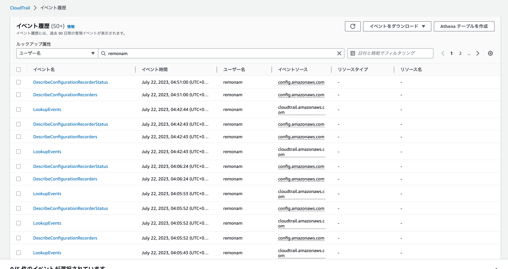  
 

### 見つけたイベントの中からイベント名と、含まれている内容を３つピックアップする
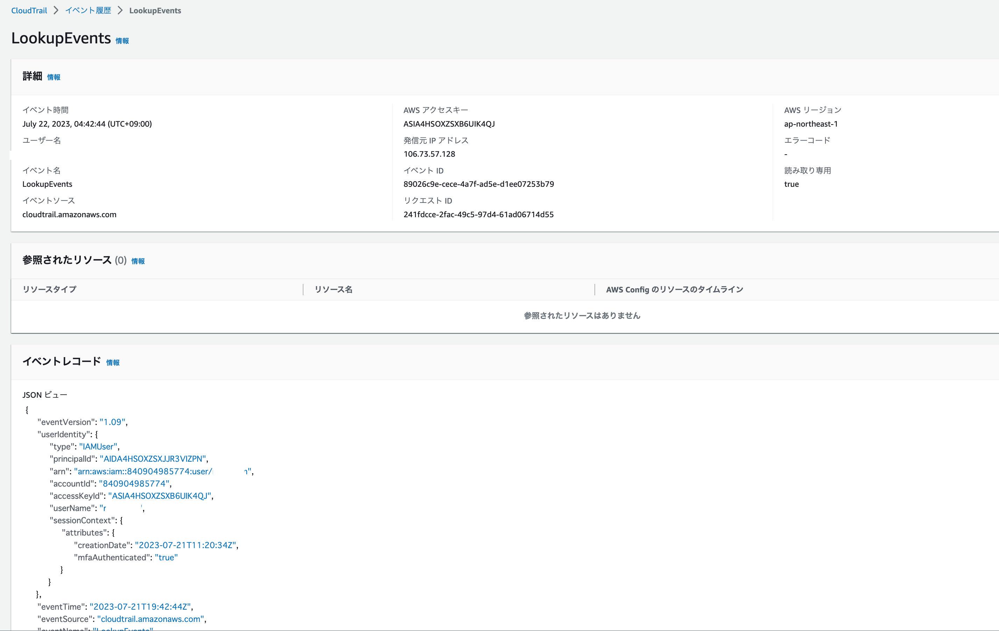

#### ①LookupEvents　のイベント履歴　▼  
イベント名：LookupEvents  
イベント時間：July 22, 2023, 04:42:44 (UTC+09:00)  
ユーザー名：your_username  
イベントソース：cloudtrail.amazonaws.com  

▼イベントの中身について
cloudtrailで自分のユーザー名で検索実行したことを表すイベント。
詳細（イベントレコード）はJSON形式で表示される。

記載される内容
誰が："type": "accountId":  
どんな権限で："sessionIssuer":   
対象はなんで： "responseElements":   
何をしたのか："eventSource": "eventName":   

参考サイト
https://blog.serverworks.co.jp/tech/2018/03/05/cloudtrail_basic/
なんでも表示されるわけではなく、以下のような情報は表示されないらしい。
- データイベント（S3バケットへのオブジェクトのPut・Get等）は非表示。
- 単なる情報表示(Describe)系は管理イベントだけど、非表示。

#### ②　CreateListener　のイベント履歴　▼

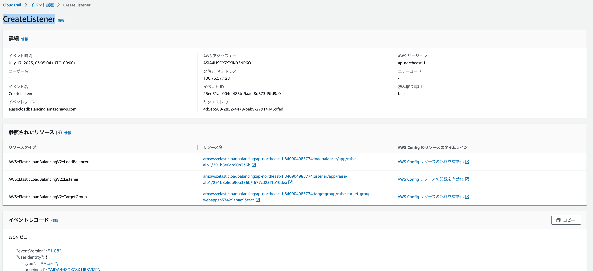
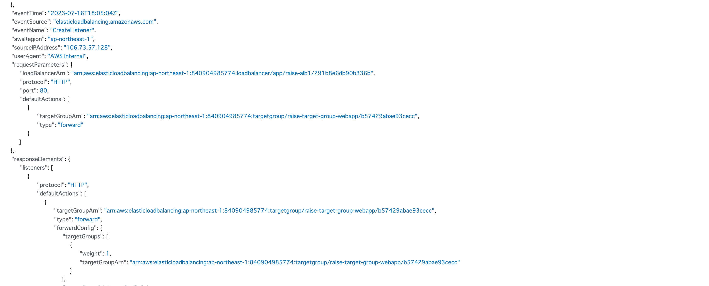
 
 
ALB設定中のうち、リスナーを設定した際のイベントは別個で出力されている模様。  
http80番設定したとか、具体的なパラメータも残っている。  
この感じだと、例えば  
いったん作業ミスして、そのあと正しく設定したのもログが残る。
CloudTrailは本当に沢山の証跡を記録している。。

#### ▼③CreateLoadBalancer　のイベント履歴　▼

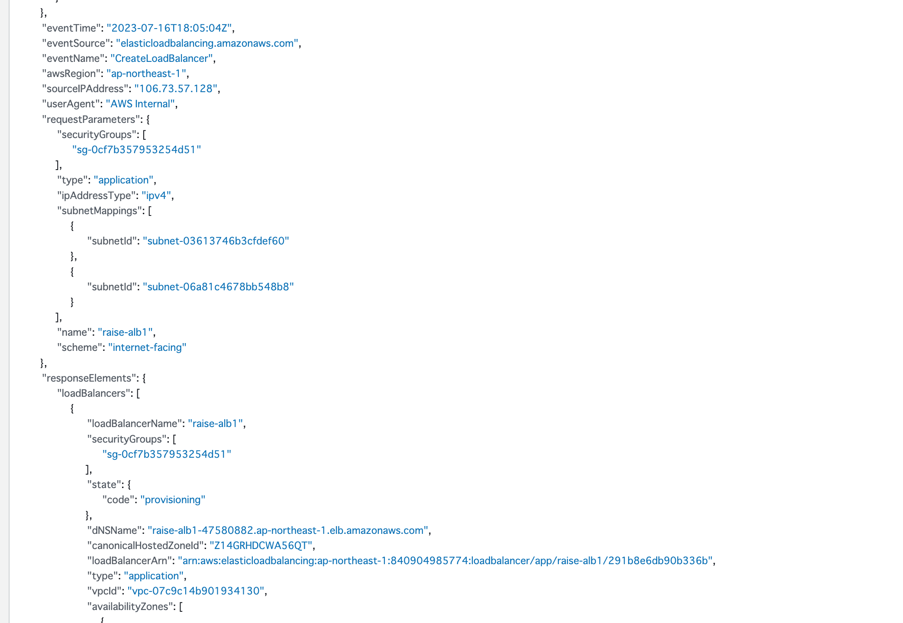
alb設定した際の内容もcloudtrailのイベント履歴には
やはり詳細に残っている。
vpcは何にしたとか、security groupを何にしたとか。

## CloudWatch アラームを使って、ALBのアラームを設定して、メール通知する

### これからやる作業  
- CloudWatchアラームで、ALBのヘルスチェックがエラーになったらアラームとする。  
- つまり異常なEC2の数を監視し、アラームが実行された場合はAmazon SNS経由でメール送信するよう設定する。
- アラーム状態が回復した際にもSNS経由でメール送信するよう設定する。

### 前提（＝構築済みのもの）  
- ALBやEC2等のリソースが作成済みで、平常時のヘルスチェックのステータスがhealthyであることを前提とします。

### 実装手順
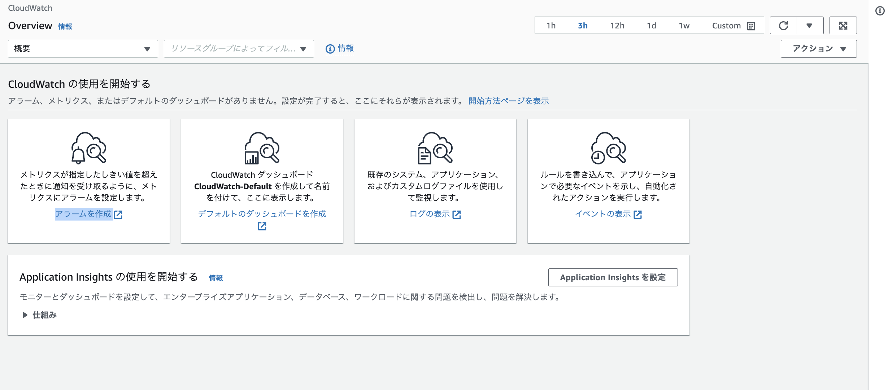
アラームの作成を選択  

- 「アラームの作成」画面で、「サービス名」からALBを選択
- AppELB を選択
- AZ別、TG 別メトリクスを選択

- 監視対象とするELBとターゲットグループのUnHealthyHostCountにチェックを入れ、メトリクスの選択をクリック  
    - ターゲットグループはEC2等のターゲットの集合体
    - UnHealthyHostCountは異常なEC2等の数

△
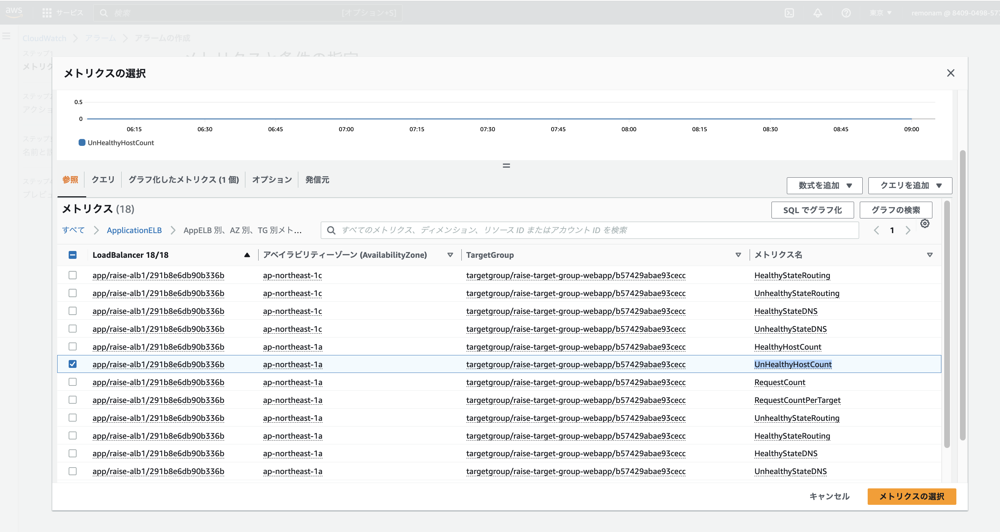

 
 

- 統計を最小へ変更  
- 期間を１分に変更　←あくまでグラフの最小値
- 条件を設定（静的　以上　１）  
- アラームを実行するデータポイントに1/1と入力  
- 欠落データの処理に欠落データを不正 (しきい値を超えている)として処理を選択  
    - EC2自体が停止している場合はデータ自体が取得できないので、アラームを実行するには、しきい値を超えた扱いにする必要がある  
△
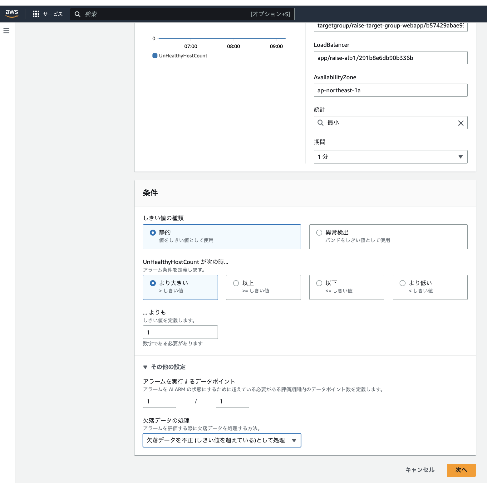

### 通知設定
アラーム状態トリガーにアラーム状態を選択  
次の SNS トピックに通知を送信に新しいトピックの作成をチェック  
新規トピック名に一意となる任意の名前を入力  
通知を受け取る  
Eメールエンドポイントにメール受け取り可能なメールアドレスを入力  
上記が全て完了したらトピックの作成をクリック  
すると   
トピックが作成される  
そのまま、次へ をクリック  
 

アラーム名を入力　例：alarm_unhealthyhostcount  
説明：　適当に入力  
次へ をクリック  

△
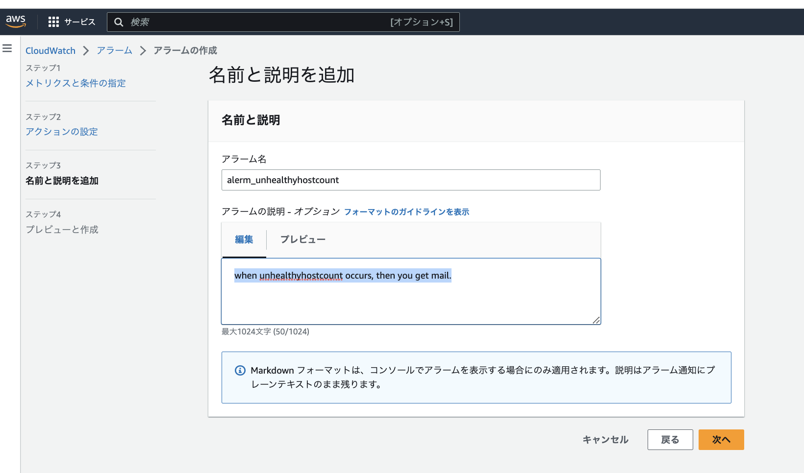

プレビュー画面が表示される  
アラーム作成ボタンを押す  

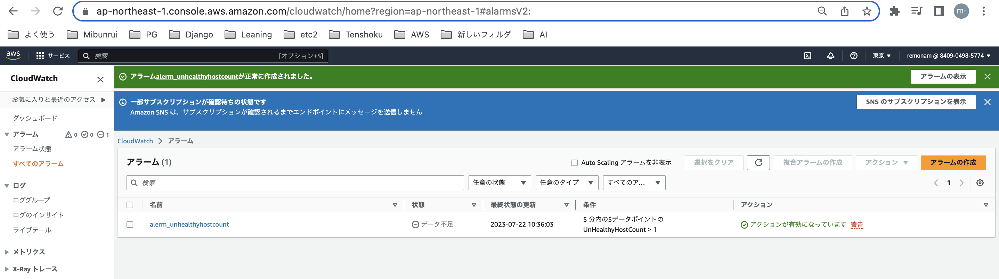

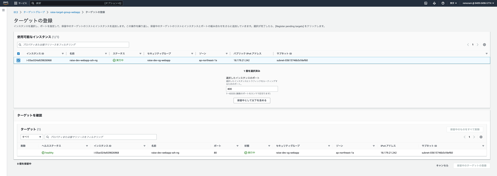

### サブスクリプション
Amazon SNS経由でCloudWatchアラームのメールを受信するためには、設定したメールアドレスに届いたメールから登録完了する必要がある。  
　↓   
設定完了した時点で以下のメールが来てたので、confirm subscriptionをクリック  
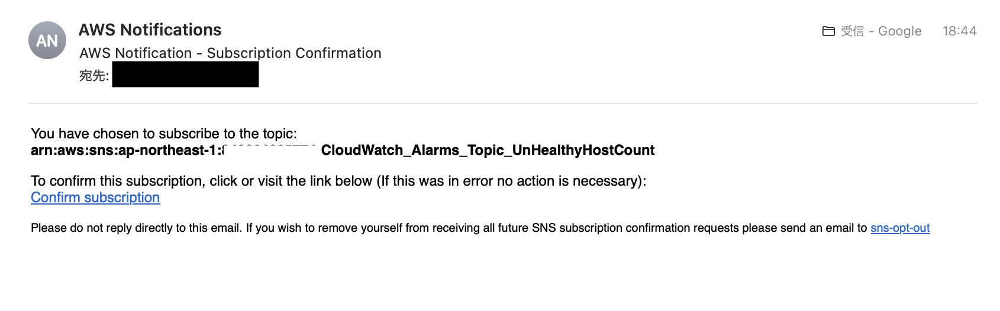
 

サブスクリプション完了
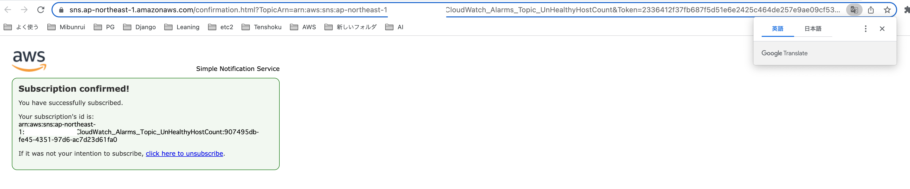
SNSにもトピックが１件出来上がっている
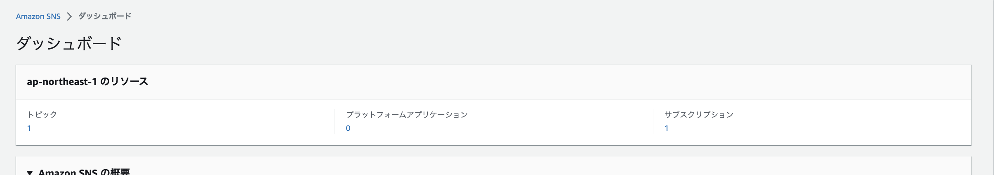
 

### アラームを発生させメール受信確認
▼一次的に、ターゲット先のEC2側のSGを設定変更してヘルスチェックエラーを起こす。  
(例：監視対象のWEBサーバのパスを、存在しないパスにする)  
　↓  
アラームメール受信できた。  
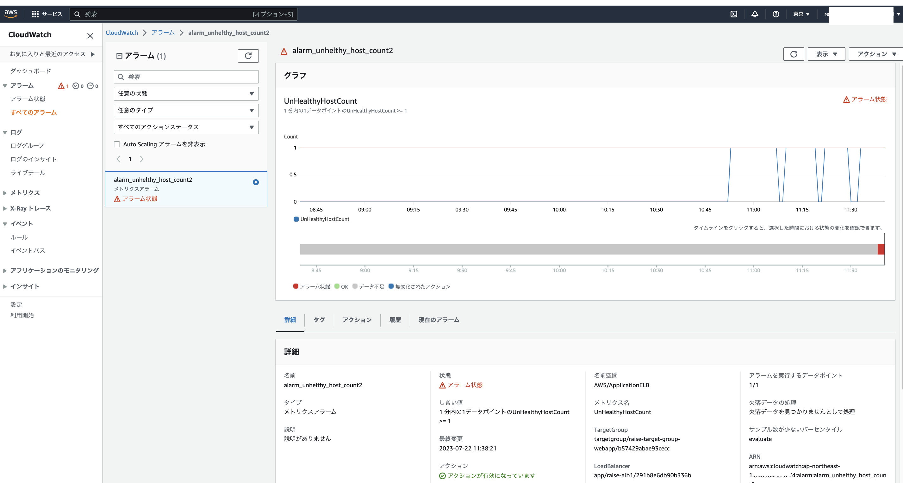
 

### アラーム　-> OKにしてメール受信確認
課題では OKアクションも設定することと書いてあるのに気づく。  
というわけで  
通知の追加で、OKアクション　も足して挙動を確認。

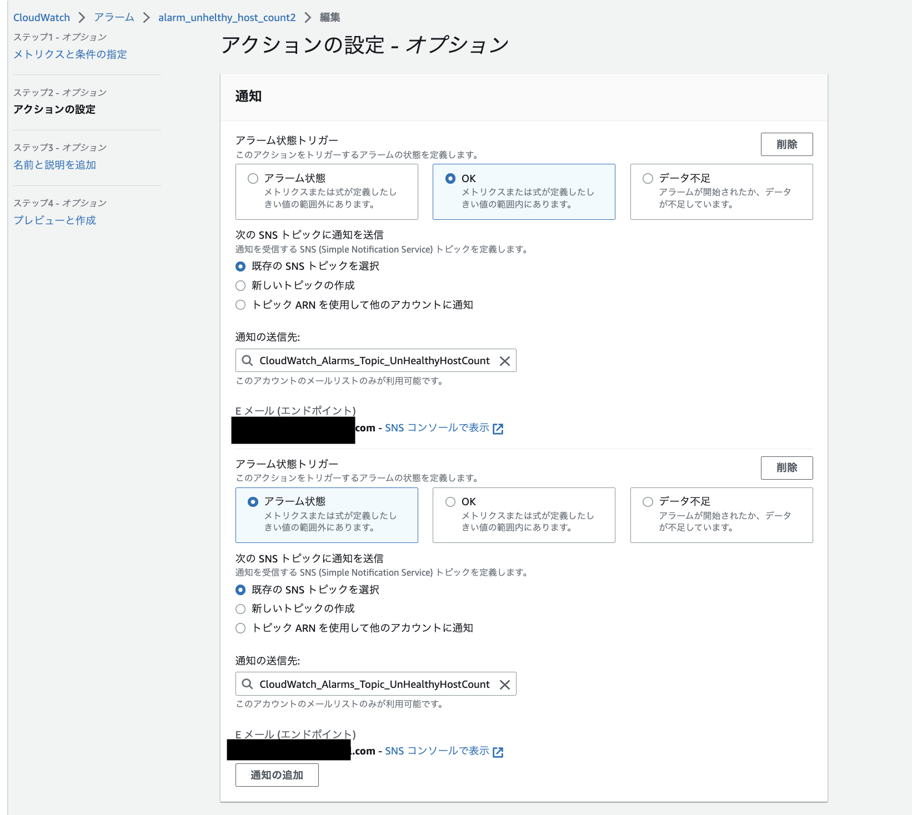

OKになったときのメールも受信できた。  
メールに  
State Change:               ALARM -> OK  
と書いてある。  
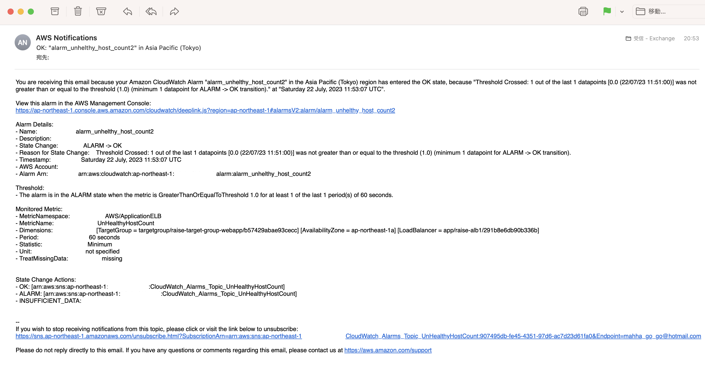

## AWS利用料の見積もりを作成する
### 作成したリソースの内容を見積もる

pricing calculator (https://calculator.aws/#/) で見積をイチから算出。  

#### EC2　を見積もる
- ロケーションタイプを選択：リージョン  
- リージョンを選択：アジアパシフィック（東京）  
- テナンシー：共有ハードウェア  
- オペレーティングシステム：Linux  
- ワークロード：一定の使用量  
- 一定の使用量  
    - このワークロードは、一定の予測可能な負荷を持つユースケースに適しています。これには、ウェブサイトへのトラフィックのログ記録やバックグラウンドでのプロセスの実行などのユースケースが含まれます。  
- 毎xのスパイクトラフィック  
    - スパイクとは、トラフィックが急激に上昇する現象を指します
    - 1 日に 1 回スパイクがあるなら「毎日の〜」を選択  
    - 毎週の特定の曜日にスパイクがあるなら「毎週の〜」を選択
    - 毎月の特定の日にスパイクがあるなら「毎月の〜」を選択
    - スパイクが起きたタイミングでAutoScalingアクションも加えて見積可能。
- インスタンスタイプ：t2.micro  

- オンデマンドを選択
    - 1日24時間使うとなると通常は　１１ドル/月くらい。

- EBS:16GB
    - 1日1回のスナップショット
    - インバウンドやアウトバウンドの通信容量も入力

#### RDS　を見積もる
Amazon RDS for MySQLを選択  

- MySQL インスタンスの仕様：db.t3.micro  
- 使用状況 (オンデマンドのみ)   24/a day
- デプロイオプション：Single-AZ  
- 価格モデル：OnDemand  
- 各 RDS インスタンスのストレージ：汎用SSD（bp2）  
- ストレージ量：20GB  

#### S3　を見積もる
- １ヶ月当たり10GB  
- S3 Standard

#### ELB（ALB）　を見積もる
- ALBを選択
- 1GB/月

### 作成した見積をURLで共有

https://calculator.aws/#/estimate?id=5c82501ec6d2bfa79ef27da73859f4a789d3f99d  

#### 概略  
１ヶ月76.25USドル。  
年間915.00USドル。  
　※AWS ウェブサイトの価格表示は税抜価格らしく、税がさらにかかる  

小規模ポートフォリオをイメージしてできる限り小さい数字を選択したが、個人学習で使うには高い。  
特にRDS for mysqlがこの中では特に高く、月40ドルで価格の半分以上を占める。  
　（Auroraにしたらさらに高いのか。。。）  
 
 

## 先月の請求情報から、EC2の料金がいくらか確認する
Billing > 請求をクリック

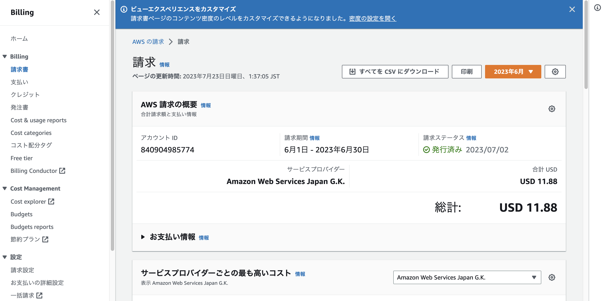
　↓　  
11.88 USドル　期間: 2023年6月1日 - 2023年6月30日
- EC2とCloudWatchで数ドル発生している　
    - なぜなら、個人的に探したAWS勉強会で使ったEC2とCloudWatch設定を放置していたためである。（先月末に気づいて設定削除した。）

## 無料利用枠に収まっているか確認する
billing > free tier　をクリック

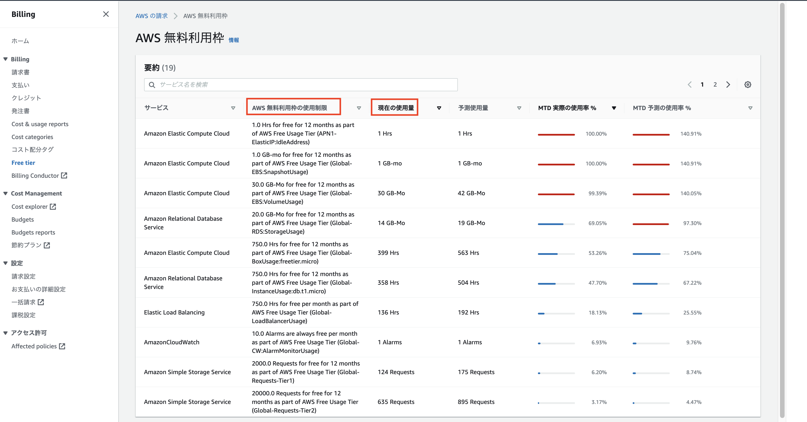
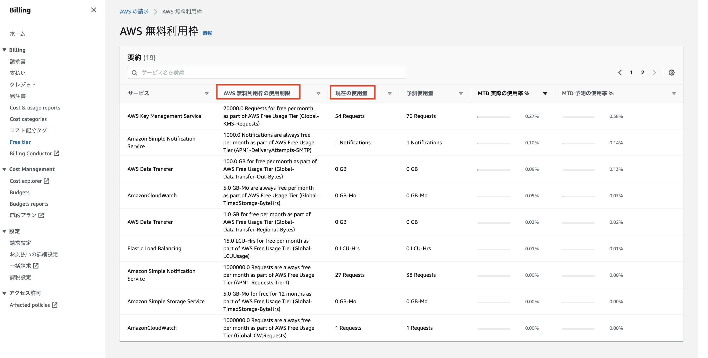

EC2とRDSがだいぶ使っていてよろしくない。
前の課題でだいぶ触ったけど課題OKもらったので、使う時以外は止めよう。

