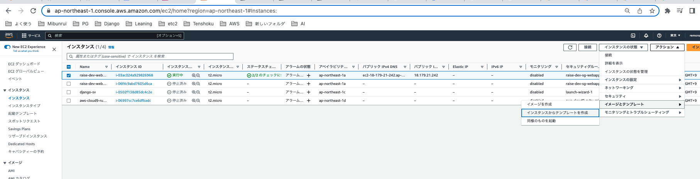
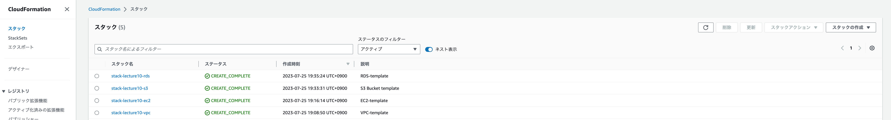
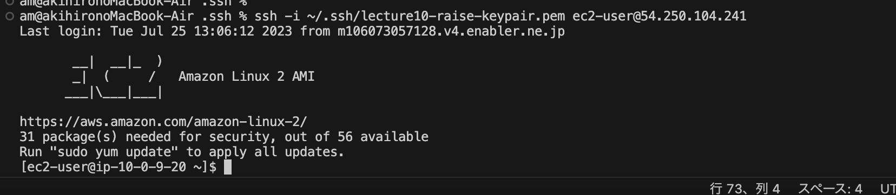
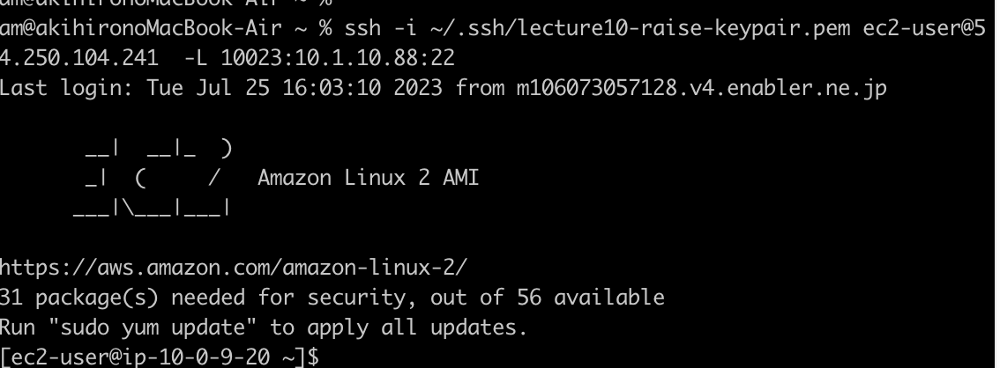

# 第10回　課題

まず、  
第５回で手動構築したAWSリソースを  
ClowdFormation用テンプレートにエクスポートできたら  
今回の課題は瞬殺じゃないですか、と思い、  
方法を探した。  

ちょっと探してみたが、  意外とこれが見つからない。  
以下サイトがそれっぽいが、  手動で作った既存AWSリソースのテンプレートを作成してくれる、という内容ではなかった。。。  
[【アップデート】ついに来た！CloudFormationで手動で作成したリソースをStackにインポート可能になりました](https://dev.classmethod.jp/articles/cloudformation-import-existing-resources/)  
[既存リソースを CloudFormation 管理に取り込む](https://docs.aws.amazon.com/ja_jp/AWSCloudFormation/latest/UserGuide/resource-import.html)  
　　 ↑　ClowdFormationテンプレートがある既存リソースをスタックに追加する手順のように見える。。

※また、EC2だけは、「既存EC2インスタンスをテンプレート化」↓みたいなことができそうだと思ったが、今回は試していない。

 [今の所の結論]  
私が求めるそのものズバリなものは無いっぽい。

よって  
諦めてネットで探したテンプレートを元にClowdFormationテンプレートを作った。

以下のスタック名で作った。  
stack-lecture10-vpc  
stack-lecture10-ec2  
stack-lecture10-rds  
stack-lecture10-s3  

スタック作成完了

なおEC2上でRailsアプリが動くようにするのはこの先の別の課題で   
Ansible使って実施するらしいので、ここでは実施しない。

というわけで、   
動作確認としては以下を行った。  
①EC2にSSHできるかどうか
②RDSにポートフォワーディングできるか
　（Railsアプリ動かないからRDS・S3のアプリ的な確認はできない。）
　（RDSにデータベース作成してないからmysqlログインも）

## EC2にSSHできるかどうかの確認
世の多くの人がEC2のキーペアを以下のテンプレート記述で作成しているみたいだったので、  
よくわからないが真似してみた。  
~~~
  CFnKeyPair:
    Type: AWS::EC2::KeyPair
    Properties:
      KeyName: CFnKeyPair
~~~

さて、  
EC2にSSHしたいのだが、  
キーペアはどうなってるのか？どこかにあるのか？  

散々ググった結果、  
CloudFormationでEC2と同時に上記記述で作成した場合には  
秘密鍵は  
Systems Manager > パラメータストア  
に保存されているとわかった。  

パラメータストアで今回生成された鍵を選択  
→値を表示してコピー  
~~~
vi ~/.ssh/xx-keypair.pem  
chmod 600 xx-keypair.pem  
~~~

EC2にSSHできた。  

RDSにもポートフォワーディングでSSHできた

