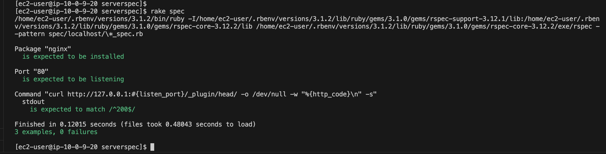

# 第11回課題提出

## 【やること最低限】
1 serverspec使えるようにする
2 実装（nginxが入っていること＋80番がlistenであることの確認）
3 動作確認

▼実際やること
1 serverspec使えるようにする
　・
　・
2 serverspecでテストしたい内容を書き出す
　・開けているポート（ssh, http）は空いていることの確認　＋　それ以外は空いていないことの確認【nmap相当の機能はserverspecに存在する？】
        ★サンプルテストコードでは、nginxが入っていること＋80番がlistenであることの確認をするらしい。
　・
3 実装
4 動作確認

## serverspec使えるようにする

参考サイト
https://qiita.com/hitomatagi/items/12f9f10ff8e95dbe0999

### ruby、rbenv、ruby-buildインストール

sudo yum update -y
sudo yum -y install git gcc-c++ glibc-headers openssl-devel readline libyaml-devel readline-devel zlib zlib-devel libffi-devel libxml2 libxslt libxml2-devel libxslt-devel sqlite-devel
git clone https://github.com/sstephenson/rbenv.git ~/.rbenv
echo 'export PATH="$HOME/.rbenv/bin:$PATH"' >> ~/.bash_profile
echo 'eval "$(rbenv init -)"' >> ~/.bash_profile
source ~/.bash_profile

 x git clone git://github.com/sstephenson/ruby-build.git ~/.rbenv/plugins/ruby-build
 x git clone https://github.com/rbenv/ruby-build.git "$(rbenv root)/plugins/ruby-build"

git clone https://github.com/rbenv/ruby-build.git ~/.rbenv/plugins/ruby-build

cd ~/.rbenv/plugins/ruby-build
sudo ./install.sh
rbenv install 3.1.2 -v
rbenv global 3.1.2

### bundlerインストール
gem install bundle

### gemインストール
gem -v
→ 3.3.7がインストール済みだった

まずbundleのベースファイルを作っていきます。

bundle init

### rakeをインストール
gem install rake

### serverspecをインストール
gem install serverspec

### aaaa

ls -al /etc/ | grep server
sudo mkdir /etc/serverspec

ls -al /etc/ | grep serverspec
sudo chown -R ec2-user /etc/serverspec
ls -al /etc/ | grep serverspec

cd /etc/serverspec

ls -al
ls -al ./spec

serverspec-init

'''
[ec2-user@ip-10-0-9-20 serverspec]$ serverspec-init
Select OS type:

  1) UN*X
  2) Windows

Select number: 1

Select a backend type:

  1) SSH
  2) Exec (local)

Select number: 2

 + spec/
 + spec/localhost/
 + spec/localhost/sample_spec.rb
/home/ec2-user/.rbenv/versions/3.1.2/lib/ruby/gems/3.1.0/gems/serverspec-2.42.2/lib/serverspec/setup.rb:155: warning: Passing safe_level with the 2nd argument of ERB.new is deprecated. Do not use it, and specify other arguments as keyword arguments.
/home/ec2-user/.rbenv/versions/3.1.2/lib/ruby/gems/3.1.0/gems/serverspec-2.42.2/lib/serverspec/setup.rb:155: warning: Passing trim_mode with the 3rd argument of ERB.new is deprecated. Use keyword argument like ERB.new(str, trim_mode: ...) instead.
 + spec/spec_helper.rb
 + Rakefile
 + .rspec
'''

###
ls -al ./spec/localhost/sample_spec.rb
sudo cp -p ./spec/localhost/sample_spec.rb ./spec/localhost/sample_spec-bk.rb
sudo vi ./spec/localhost/sample_spec.rb

:%d　で全行削除してスクール提供のsample_spec.rbの内容貼り付けて :wq!

### nginxインストール
sudo amazon-linux-extras install -y nginx1
nginx -v
sudo cp -p /etc/nginx/nginx.conf /etc/nginx/nginx.conf-bk
sudo systemctl enable nginx
curl http://127.0.0.1:80

## 動作確認
rake spec

↓　無事成功。
 - nginxが入っていて、８０番ポートがListen状態であり、curlの結果は200-OKが返ってきている
 - 0 failuresになっている

