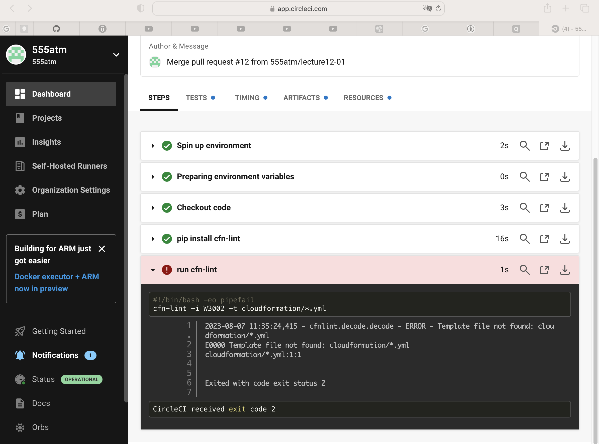
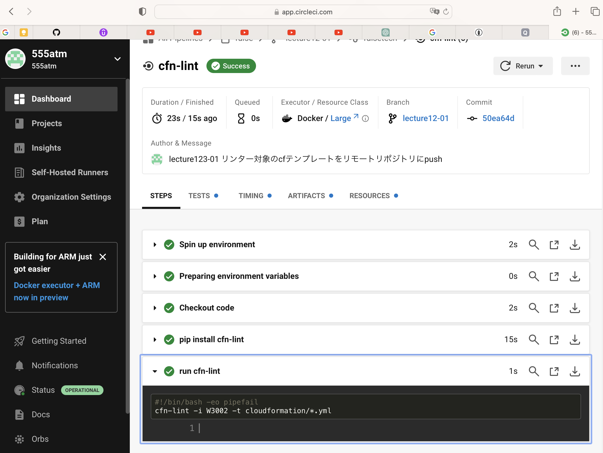

# 第12回課題提出

## タスク
- CircleCIの導入
    - 提供されたCircleCIサンプルコンフィグが正しく作動するようなリポジトリの内容にする（つまりcf用リンターでcfテンプレートをリントする）
        1. まずは[公式ドキュメント通り](https://circleci.com/docs/ja/2.0/getting-started/)に操作して動作について理解する
        2. 次に、課題のリポジトリでプロジェクトの設定を行い、`config.yml`を提供したものに書き替える
            - 以下の動作がコミットのタイミングで行われるよう定義してあります。課題の参考にしてください。
            - [cfn-lint](https://github.com/aws-cloudformation/cfn-lint)が`cloudformation`ディレクトリ内の`yml`ファイルをチェックする


## 参考サイト・参考動画

【チュートリアル】01 CircleCIをはじめよう！
　https://www.youtube.com/watch?v=cOHKRYgdzDY


## 実施内容

### 1.まずgithubにcircleci用リポジトリを作っておく
※自分の要件に合うなら既存リポジトリを使っても良い。   
　というわけで既存リポジトリを使った。　　

### 2.CircleCIの初期登録＋ログイン＋初期設定

CircleCIのHPへ移動　> Sign up with GitHub　を選択   

対象レジストリを設定  
　↓  
circleciに対象レジストリを設定すると、circleciは作動するらしい。  
　↓  
まだconfig.ymlすら配置していないのでテストのステップでエラーとなった模様。  


### 3. .circleci/config.ymlの内容をサンプルコンフィグどおりにする

```sh
sudo mkdir .circleci
touch .circleci/config.yml
```

サンプルのconfig.ymlの内容を.circleci/config.ymlに貼り付け  
上記をgitでpush

結果、  
まだリンターの対象ファイルも配置していないが、  
試しにgitでpushしてみたところ、以下のエラー。  
cfn-lintのところでエラーとなっている。  
cloudformation/*.ymlに該当するものはまだ何も配置していないので、当然エラーとなった。  


### 4. cloudformation/*.ymlを配置

リンター(cfn-lint)の対象ファイルをgitでpush  
  
cloudformation/*.ymlに該当するものが配置され、  
リント結果も成功したため全ステップがsuccessとなった。  

