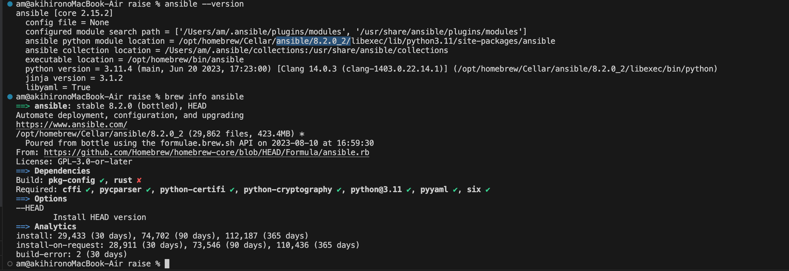
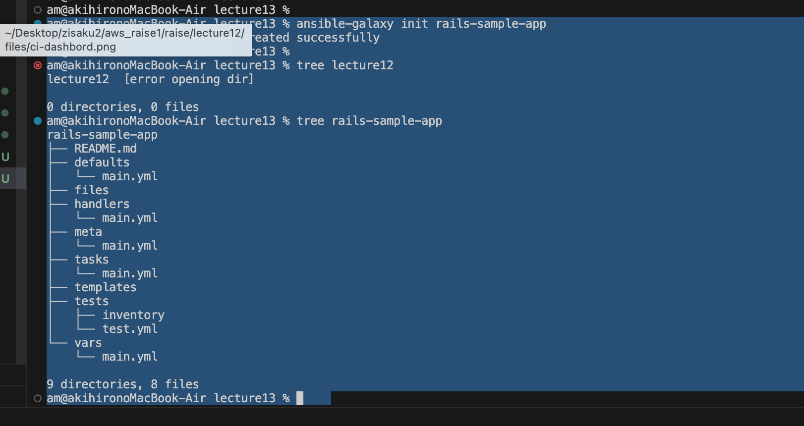
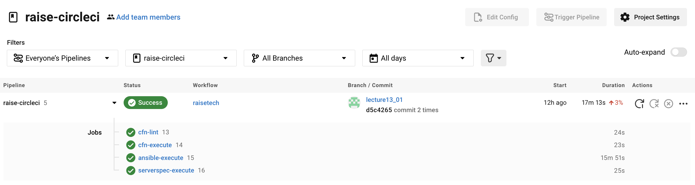
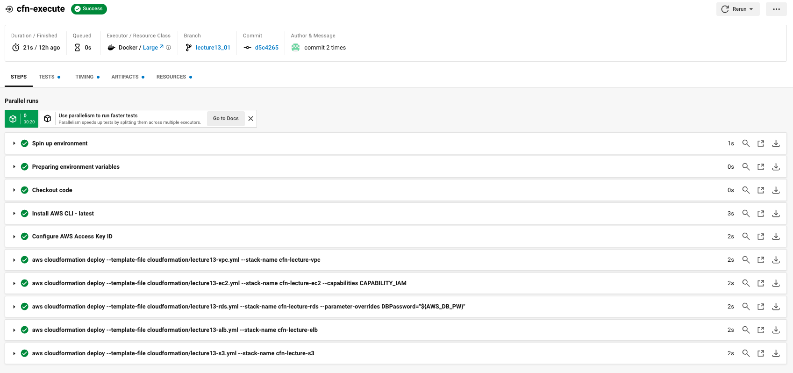
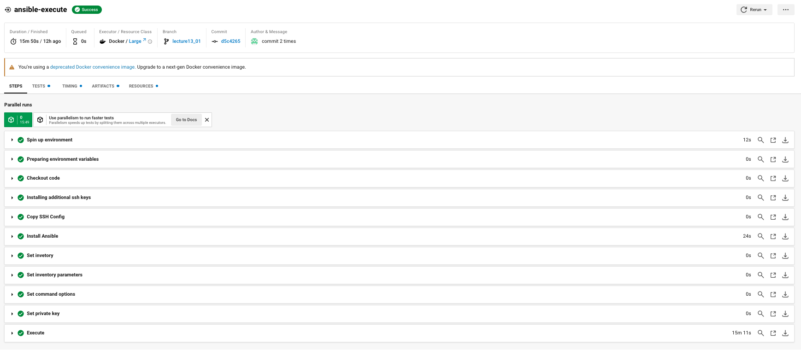
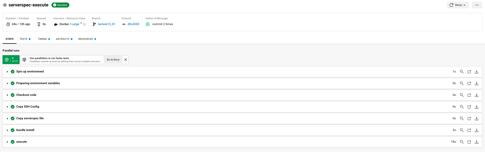
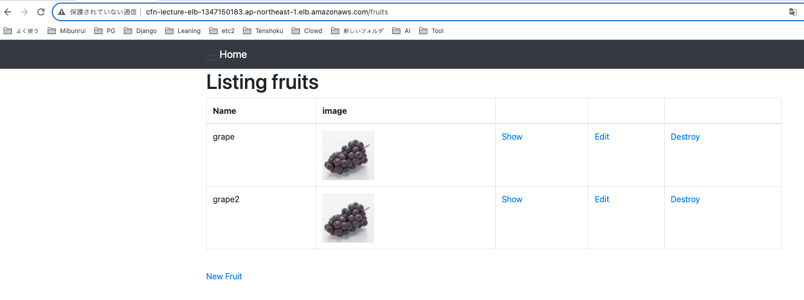
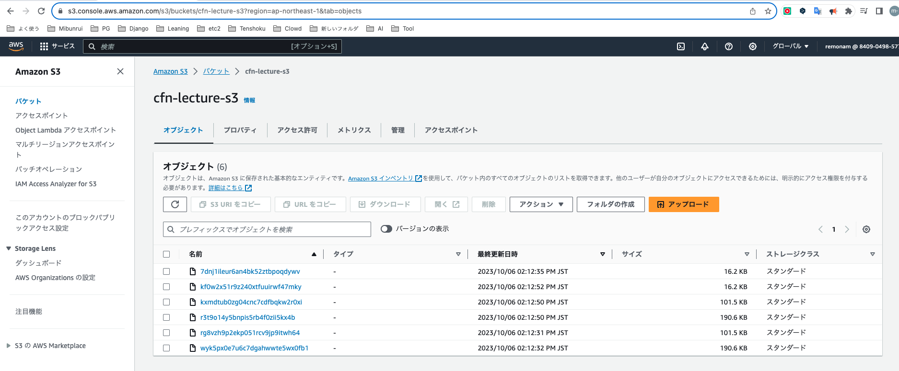
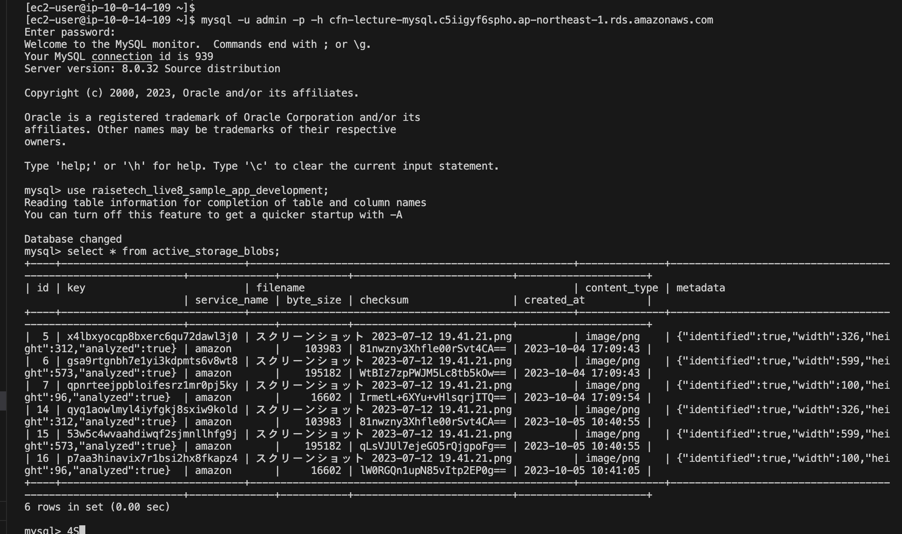

# 第13回,第14回 課題提出

## 第13回課題
・CircleCI のサンプルに ServerSpec や Ansible の処理を追加してください。  
・Ansible はいきなりやりたいことを実装するのではなく、  
　最低限の「必ず成功する Playbook」を用意して徐々に仕事を追加しましょう。  

## 第14回課題
ここまでのAWS構成図、自動化処理がわかる図、  
リポジトリの README を作る。  


## Ansibleを触って慣れる

①　まずコントロールノード（ ＝Ansibleサーバ ）を立てる  
　　↓  
　　自分のPCにansibleをインストールすることとする。  
　　macなのでhomebrew使ってインストール。  
    　　　→→ コントロールノードによって構築される側（＝今回だとEC2）のことはターゲットノードと呼ぶ。  
  
　　※EC2（APサーバ）にAnsible入れることも一瞬考えたが、よくよく考えると面倒が多そうなのでやめた。  
　　　　EC2（APサーバ）がコントロールノードもターゲットノードも兼ねるなんて構成は現場でもやらないはずだし。    　
　　　　それよりも、自分の作業PCからgit pushひとつでCFでインフラ構築 ＋Ansibleで構成管理する学習をしたほうがきっと汎用的と判断。  
　　　　　　＜まあ現場では専用のAnsibleサーバ端末用意したり、踏み台サーバあたりをAnsibleサーバ兼用にしそうな気がするが。＞  
　　　　
　　　　※ちなみに、WindowsPCにAnsibleインストールしたい場合は  
　　　　　　サーバ仮想化ソフト（Vmware、VirtualBoxあたり）かdockerを使うなどしないとダメみたい。（私のはMac）  
　　　　
　　　　※Ansibleは実行元と実行先それぞれpythonが入っていれば動作する。  
　　　　（chefやpuppetの場合だとエージェント型なので実行元にエージェントインストールしないとダメ）  

② ホスト構成定義（Inventory）を記述する  
　対象はEC2 1台。  
　　※今回は実施しないが、当然ながらば複数台に同時に命令をすることが可能  

③ サーバー構成定義（Playbook)を記述する  
　　第５回と同様の内容をansible用に書き換えていく。　  

## やったこと

### Ansibleのインストール

Ansibleサーバ　＝　コントロールノードを立てる  
　※ macにhomebrewはインストール済み  
　※ macにpythonはインストール済み  

```
  brew search ansible

  brew info ansible
  8.2.0がstableらしい。

　brew install ansible
  ansible --version
```

インストールされたのは下記バージョン  
- ansible8.2.0-2  
- ansible-core(2.15.2)  
  



### Ansibleの設定ファイルを作成

メモ。  
Ansibleの設定ファイル（InventryとかPlaybookとかcfgファイルとか）のファイル名については、任意の場所で良い。  
配置場所やディレクトリ構成、ファイル名などに指定はない。  
  
また、Ansible設定ファイルの場所は、  
Ansibleコマンド実行時に認識できる場所に置いてあれば良いと思われる。  
  
▼ansible-garaxyコマンドでフォルダとファイルのセットを生成可能らしいので、やってみる。  
```
cd lecture13
ansible-garaxy init rails-sample-app
brew install tree
tree rails-sample-app
  ※　ちなみにWindowsにもtreeコマンドはあるけど、ファイル名まで表示したい場合は/fオプションつけないといけないらしい。
```



参考：　Ansibleのベストプラクティスなディレクトリ構成を試す  
　https://tk-ch.hatenablog.com/entry/20230304/1677858567#%E3%83%87%E3%82%A3%E3%83%AC%E3%82%AF%E3%83%88%E3%83%AA%E6%A7%8B%E6%88%90


### 自PCに疎通確認

adhocコマンド（の中のpingコマンド）で疎通確認を行い、inventoryの記述を認識できているか確認してみる。  
inventoryファイルは ansible-garaxyで生成されたままの以下内容のまま。  
  
▼inventory  
```
localhost
```

まずはlocalhostに『ansible localhost -m ping』してみる。  
　※なお『ansible -m ping』はicmp（つまりLayer3）による疎通確認ではなく、対象にansible利用可能なpythonが入っているかなどを確認しているらしい。  
　　宛先ポートは22番っぽい。  
　　　→ 参考サイト　https://qiita.com/atsushi586/items/ab4c8c6256274741b953

↓結果、  
"pong"が帰ってきているので成功しているらしい。（ピンに対してポンというレスを返すのは、遊び心かな。）  
```
ansible -i ./rails-sample-app/tests/inventory.ini localhost -m ping

[WARNING]: Unable to parse /Users/user/Desktop/raise/lecture13/rails-sample-app/tests/inventory.ini as an inventory source
[WARNING]: No inventory was parsed, only implicit localhost is available
localhost | SUCCESS => {
    "changed": false,
    "ping": "pong"
}
```


### ターゲットノード（EC2）に疎通確認

続いてEC2 に疎通確認。  

▼以下の通り、inventoryを以下の記述にした  

``` inventory.yaml{.copy.}
all:
  vars:
    ansible_user: ec2-user
    ansible_ssh_private_key_file: "../../../../../.ssh/lecture10-raise-keypair.pem"
  hosts:
    ec2:
      ansible_host: 3.112.203.31
      gather_facts: yes
      remote_user: root
```


▼以下の通り、ping pong返ってきたのでOK。  
```
ansible -i ./rails-sample-app/tests/inventory target -m ping 
[WARNING]: Platform linux on host 3.x.x.31 is using the discovered Python interpreter at /usr/bin/python3.7, but future installation of another Python interpreter could change the meaning of that path. See
https://docs.ansible.com/ansible-core/2.15/reference_appendices/interpreter_discovery.html for more information.
3.x.x.31 | SUCCESS => {
    "ansible_facts": {
        "discovered_interpreter_python": "/usr/bin/python3.7"
    },
    "changed": false,
    "ping": "pong"
}
```

疑問だったのが、  
ファイル名はinventory.ymlではなくinventoryなのに、  
ansible -i inventory.yml localhost -m pingは成功し、  
ansible -i inventory localhost -m pingだと失敗する。
なぜ？？  
　↓
chatGPTさんがいうには、  
おそらくansibleはデフォルトで、inventoryというファイル名だとinventory.iniだと自動認識してくれるらしい。  
実際の結果に即しているので鵜呑みにしておこう。  

なお、ansibleコマンドは -aオプションでlinuxコマンドを直接実行できる。
（例）ansible -i ./rails-sample-app/tests/inventory target -a "ls -al"
     ansible -i ./rails-sample-app/tests/inventory target -a "hostname"


### Ansibleに慣れるまではdebugモジュール使ってdebugすると良さそう

最初、inventoryやplaybookがちゃんと書けてないのに  
Ansible走らせたら何もエラーが出ず、訳がわからないという状態になった。  
  
プログラミングのデバッグと一緒で、   
以下のようにdebugモジュールを使って、動作確認しながら進めたところ、理解が捗った。  
```
debug: msg="Step1-1"

- name: yum update
  become_user: root
  yum: 
    name: "*"

debug: msg="Step1-2"

- name: yum install package
  # become: yes
  become_user: root
  yum:
    name:
      - git
      - gcc-c++
      - patch
      - bzip2

```

### playbookを編集してansibleに慣れる

ちなみに
ロールは[Ansible Galaxyのサイト](https://galaxy.ansible.com/)のBrowse Rolesのページで探すことができるらしい。


#### rawモジュール、commandモジュール、shellモジュールとかは、冪等性の対象外だから、最終手段らしい！ということに気づいたというお話。

最初、課題５で打ったlinuxコマンドをそのまま  
rawモジュールとかcommandモジュールとかで書けば  
すぐ終わるじゃん！と思っていた。  
```
- name: Gitをインストール(rbenvをインストールするため)
  raw: sudo yum install git -y

あるいは

- name: Gitをインストール(rbenvをインストールするため)
  command: sudo yum install git -y
```
のだが、これだとPLAY結果が毎回changedになってしまうことに気づいた。  

ググってみると、  
rawモジュールとかcommandモジュールとかは  
冪等性の対象外なので、なるべく使うべきではないということがわかった。。。。  
やはり地道に各yumモジュール（yumモジュールとか）などの使い方、オプションを覚えなきゃいけないんですね。  
覚悟を決めます。  


#### yumモジュールの各state(present,installed,latest,absent,removed)の違い  

Ansibleのyum module:各state(present,installed,latest,absent,removed)の違い  
https://qiita.com/tkit/items/7ad3e93070e97033f604  
　↓
state:latestを使わない方が良いらしい。
なぜなら、冪等性が崩れるから。
　１回目と２回目とで、別バージョンをインストールしようとしてしまう可能性があるから。
よって、
 パッケージのバージョンを固定したければ、そもそもlatestを使わずに、presentかinstalledを使うべき


#### with_itemsについて

一回のtaskで複数個実行したい場合は以下の書き方をすれば良い。
```
- name: 03-13.check rails install
  command: "{{ item }}"
  with_items:
    - bash -lc "gem list -e rails"
    - bash -lc "gem list rails"
```


#### トライアンドエラー　　＋　-vvvオプションは便利だというお話

ansible-playbookコマンドの末尾に-vvvをつけて実行すると超詳細コードみたいなので実行してくれる。  
　↓ 例  
```
ansible % ansible-playbook -i inventory.yml playbook.yml -vvv  
```
これはデバッグに使えそう！！  
  


## circleciを動かす

だいぶローカルAnsibleに慣れたので、  
そろそろcircleci　→CloudFormation,Ansibleなど動かすのに着手。  


### circleciの準備

.circleci/config.ymlを編集。  
CloudFormation、  
Ansible、  
serverspecを実行する記述を行う。  
  
orbsというのを使う。  
orbsごとにコンテナを作ってくれている模様。  
  
各種変数、シークレット情報をcircleciのGUIでEnvironment Variablesに定義。  
SSHキー情報もGUIで登録。  
  
ssh用設定ファイルや  
railsで使う各種ファイルも  
githubをローカルと見立ててターゲットノードにコピーしてくれる。  
  
serverspecで  
EC2にインストールしたものが指定バージョンになっているか確認。  
nginx,unicornが起動できているか確認。  
ec2ローカルでcurlコマンドで200 OKが返ってくるか確認。  
  
トライアンドエラーしながら各種コード作成。  
  


### AWS CLIでCloudFormaitonでIAMリソース作成
aws cliでcloudformationでIAMリソース作りたい時は  
--capabilities CAPABILITY_IAM  
というオプションをつけないといけないっぽい。  
```
      - run: aws cloudformation deploy --template-file cloudformation/lecture13-ec2.yml --stack-name cfn-lecture-ec2 --capabilities CAPABILITY_IAM
```

## ついに完成
### githubにpush実行するだけでAWS構築、サーバ構築、テストまで全自動

githubのレポジトリにpushしただけで、  
AWSリソースが作成され、  
サーバ構築とソースコードデプロイが行われ、  
serverspecがテストしてくれて、  
webアプリが動くようになる。  
感動。  

- circleの全タスクが正常終了



- cfn-executeの実行結果



- ansible-executeの実行結果


- serverspec-executeの実行結果


## デプロイしたサンプルアプリケーションの動作確認

- ALBのDNS名でアクセスし、New Fruitから入力し反映されることを確認


- バケットに保存されていることを確認



- RDS内に投稿内容が保存されていることの確認



- 第5回課題で作成したAWS構成図に自動化処理の図を追加する


# リポジトリのREADMEを作成する

[README.md](../README.md)

# 今回の課題から学んだことを報告する


#### 参考動画、参考サイト、参考書 （Ansibleについて）

▼参考動画（ansible)  
　【第1〜７回】Ansibleを学ぼう。Ansibleとは？　  
　https://www.youtube.com/watch?v=NtNbMYkoG7w  
    ↑ 第３回ぐらいから具体的でタメになる。  

　Ansible入門講座  
　https://www.youtube.com/watch?v=LKSWE_endX8&list=PL_RwLDGrI9OukEWiXyLWKxy-ccuBReL-o  

▼参考サイト（ansible)

　Ansibleの使い方　　★体系的！　網羅的！★  
　　https://zenn.dev/y_mrok/books/ansible-no-tsukaikata/viewer/chapter1  

　【Ansible】入門②Inventoryの基本的な記述方法  
　　https://www.wantanblog.com/entry/2021/06/20/160831 


　Ansible を使って EC2 に Railsサーバーを立ち上げる  
　　https://qiita.com/katsuhiko/items/c84a282f3a56d71c404f  
  
  
▼参考書（ansible)  
正直、ansibleは参考書を買って学ぶ必要があるくらい、学習コストがかかるものだと感じた。  
  
▼ansible参考書と目次  
  
【2023年版】Ansibleのおすすめ本3選（ https://engineer-life.dev/ansible-books/ ）  
　　↓  
① Ansible実践ガイド 第4版［基礎編］  
　　https://book.impress.co.jp/books/1122101189  
　　　↑　　  
　　目次からしていかにも基礎編といった印象。  
　　この程度なら無料のyoutube動画で良いかも。  
  
②Ａｎｓｉｂｌｅクックブック/インプレス/大嶋健容  
　目次→ https://www.amazon.co.jp/Ansible%E3%82%AF%E3%83%83%E3%82%AF%E3%83%96%E3%83%83%E3%82%AF-impress-top-gear-%E5%A4%A7%E5%B6%8B/dp/4295013544  
　　　↑  
　　辞書的な本。　  
　　OS基本設定編（パッケージインストールなど）、情報取得編、Vmare操作編、Docker編、Kubernetes編、  
　　ルータ/スイッチ編、　LB編、SDN編　などと分かれている。  
　　オンプレ 〜 モダン開発までで使われれる幅広い技術に対応していて好印象◎。  
  
  
③Ａｎｓｉｂｌｅ構築・運用ガイドブック インフラ自動化のための現場のノウハウ/マイナビ出版/八木澤健人  
　目次→ https://book.mynavi.jp/ec/products/detail/id=112246  
　　　↑  
　　Iacの必要性から順序立てて丁寧に説明していそう。  
　　ハンズオン形式っぽそうなのは良いが、Vagrant使用するのが前提なのかな？  
　　紹介内容は　Zabbix構築、WindowsServer構築、NW機器操作、  
　　　クラウド連携、あとAWS(Ansible　Tower）について、　などなど  
　　　　　②の本とはまた違うカバー範囲だと思われる。  


